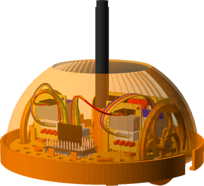

LogoBot
=======

Cheap, extensible mobile robot design based on Arduino - inspired by Mirobot and others.  Many of the parts are 3D printed, using a tool-less pin system to connect to the base plate.  The non-printable *vitamins* are low-cost, common and globally available.

See the [Assembly Guides](http://rawgit.com/swindonmakers/LogoBot/master/hardware/docs/index.htm) for easy to follow build instructions and links to the printable STLs.

Developed by the Swindon Makerspace (UK) - see [LogoBot wiki page](https://github.com/swindonmakers/swindonmakers.github.com/wiki/LogoBot) and [related Google Groups thread](https://groups.google.com/d/topic/swindon-hackspace/0EO_l_R9aW0/discussion)

Various photos of LogoBot builds can be found on the [Flickr group](https://www.flickr.com/groups/logobot/), please contribute if you build one!  Videos are collated in the [LogoBot youtube playlist](https://www.youtube.com/playlist?list=PLYuoVOMOzIhp9adQuXN-J07fskV5hSPBj).

Two of the variants are shown below - the basic design and the Scribbler variant that includes a pen lift:

Design Principles
-----------------

* Help teach electronics, programming, 3D design and 3D printing (both to ourselves and others)
* Highly interactive - to attract/hold attention
* Cheap (Total BOM <£20)
* Suitable for ages 6 - 100
* Simplicity is key - all parts/functionality must be easy to explain and understandable by 6-yr olds
* Solderless (where practical)
* Extensible - more sensors, more functionality
* Personalisable - we don't want lots of bland, generic little robots
* Include a Logo interpreter - as per it's namesake :)

File Structure
--------------

* hardware - all OpenSCAD models, and will contains electronic models in the future (e.g. PCB layout)
* software - firmwares and host implementations

Contributions
-------------

Development planning will be coordinated through the normal Wednesday meetings (i.e. who is working on what).  All project members will be given write access to the repo.
