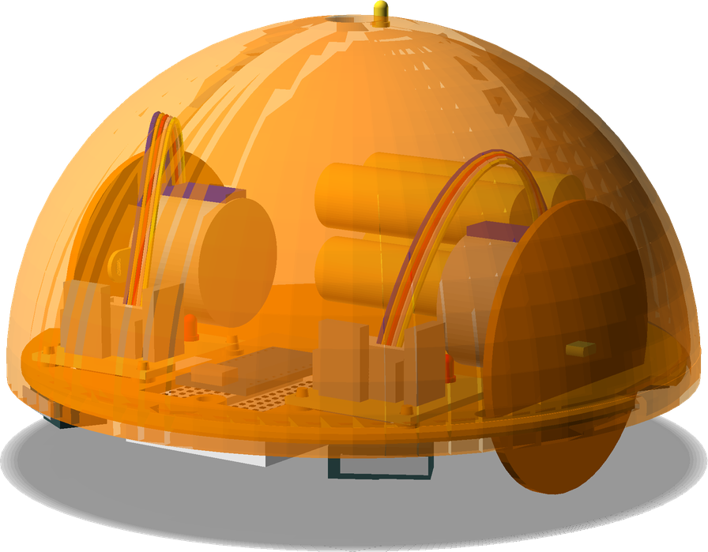
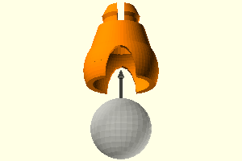
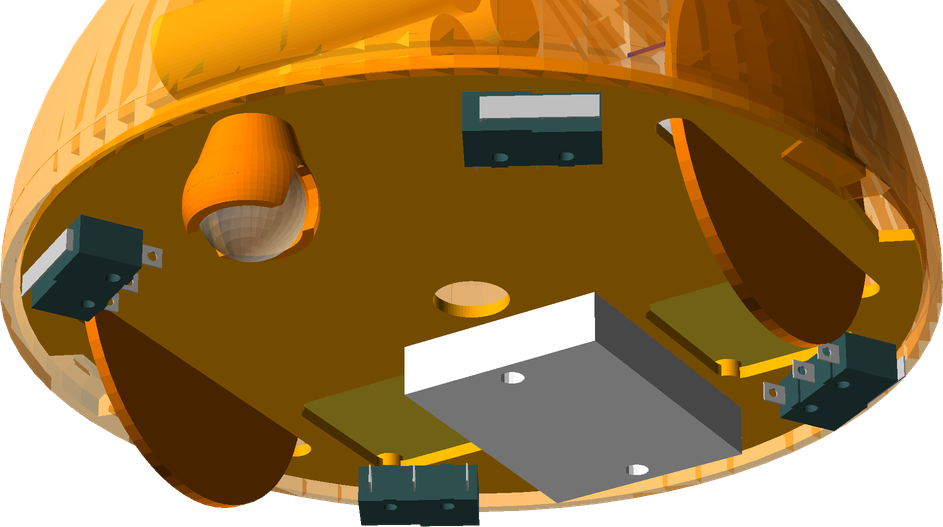

# LogoBot Assembly Guide

## Introduction

The LogoBot build is broken down into sub-assemblies that can be worked on sequentially by one person, or in parallel if there is more than one person building.

All the diagrams can be viewed in OpenSCAD allowing real time zooming, rotating and panning to get the best view.

## General Build Tips

* X if left/right, Y is backwards/forwards, Z is up.down

## Tools Required

* Screwdriver ?

### Consumables

* 4x AA Batteries

# Instructions

## 1. Caster Assembly

###Vitamins

* 16mm Marble

### Printed Parts

Qty | STL Filename | Image
--- | ------------ | -------
1 | [MarbleCaster.stl](stl/MarbleCaster.stl) | 

###Assembly

* Insert the marble into the printed housing

## 2. Base Assembly

### Vitamins

* None (yet)

### Sub-Assemblies

Qty | Sub Assembly Name
--- | --------------
1 | [Caster Assembly](#1-caster-assembly)

### Assembly

* Push the caster assembly into the base so that it snaps into place
