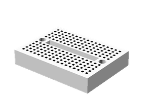

## LogoBot Assembly

### Vitamins

 Qty | Vitamin | Image 
 --- | --- | ---
  1  | [Breadboard_170](../vitamins/Breadboard.scad) | 

### Printed Parts

 Qty | STL Filename | Image
 --- | --- | ---
  1  | [LogoBotBase.stl](../stl/LogoBotBase.stl) | 

### Sub-Assemblies

Qty | Sub-Assembly Name
--- | ---
  1 | [MarbleCaster Assembly](#MarbleCaster Assembly)
