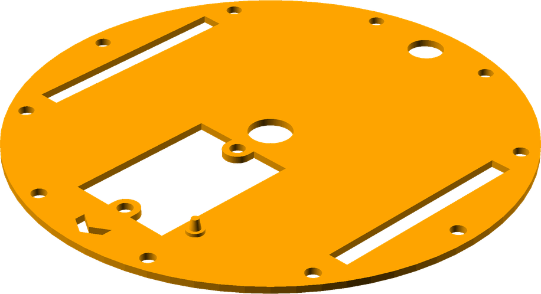
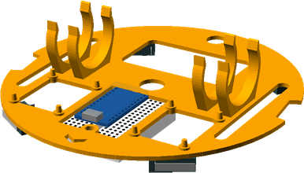
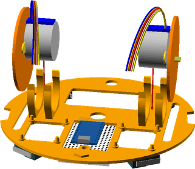
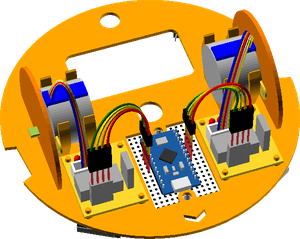
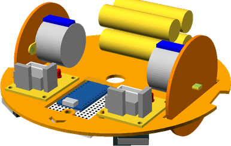
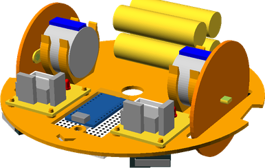
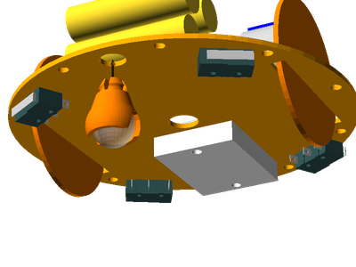
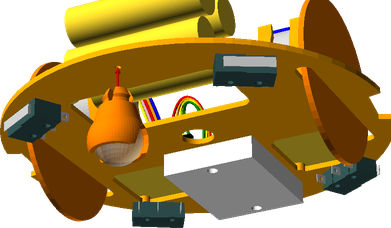
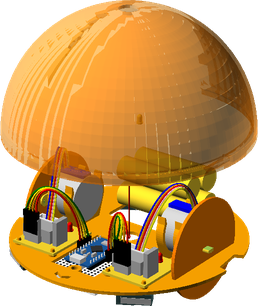

## LogoBot Assembly

### Vitamins

 Qty | Vitamin | Image 
 --- | --- | ---
  2  | [JumperWire_FM4](../vitamins/JumperWire.scad) | 

### Printed Parts

 Qty | STL Filename | Image
 --- | --- | ---
  1  | [BasicShell.stl](../stl/BasicShell.stl) | 
  1  | [LogoBotBase.stl](../stl/LogoBotBase.stl) | 

### Sub-Assemblies

Qty | Sub-Assembly Name
--- | ---
  1 | [Breadboard Assembly](#Breadboard Assembly)
  1 | [MarbleCaster Assembly](#MarbleCaster Assembly)
  2 | [Wheel Assembly](#Wheel Assembly)

### Assembly Steps

1. Connect the breadboard assembly to the underside of the base

2. Connect the two bumper assemblies

3. Connect the two wheel assemblies

4. Push the two motor drivers onto the mounting posts

5. Connect the jumper wires between the motor drivers and the Arduino

6. Clip in the battery pack

7. Clip the LED into place

8. Clip the piezo sounder into place

9. Push the caster assembly into the base so that it snaps into place

10. Push the shell down onto the base and twist to lock into place

