# LogoBot Polar Graph
# Assembly Guide

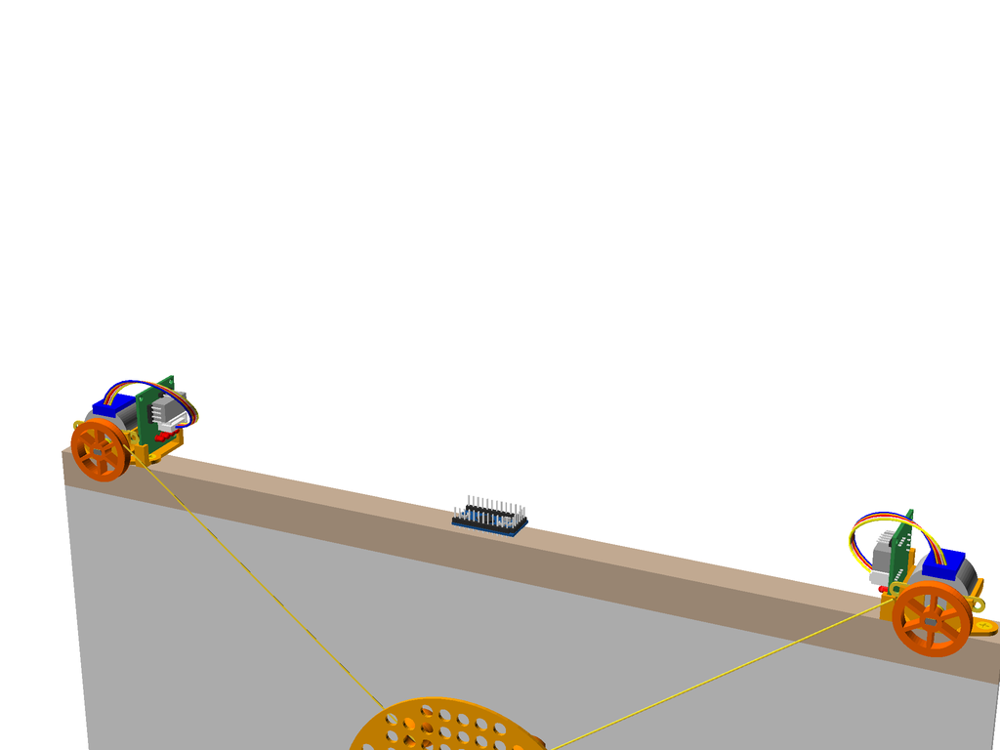

Re-uses most of the LogoBot vitamins and printed parts to make a basic polar graph drawing machine

## Bill of Materials

Make sure you have all of the following parts before you begin.

### Vitamins

Qty | Vitamin | Image
--- | --- | ---
1 | [Arduino Pro Mini Pins on top, inc serial pins]() |  | 
8 | [3mm LED]() |  | 
3 | [16mm Marble]() |  | 
1 | [9g Micro Servo]() |  | 
1 | [Fine Line Pen]() |  | 
1 | [Servo Horn]() |  | 
2 | [28YBJ48 Stepper Motor]() |  | 
2 | [ULN2003 Driver Board]() |  | 

### Printed Parts

Qty | Part Name | Image
--- | --- | ---
2 | [Capstan](../printedparts/stl/Capstan.stl) |  | 
1 | [Left Motor Clip](../printedparts/stl/LeftMotorClip.stl) |  | 
1 | [Base](../printedparts/stl/Base.stl) |  | 
3 | [Caster Housing](../printedparts/stl/CasterHousing.stl) |  | 
1 | [Pen Lift Holder](../printedparts/stl/PenLiftHolder.stl) |  | 
1 | [Pen Lift Slider](../printedparts/stl/PenLiftSlider.stl) |  | 
4 | [Pin Tack H7](../printedparts/stl/PinTackH7.stl) |  | 
2 | [Pin Tack H9](../printedparts/stl/PinTackH9.stl) |  | 
1 | [Right Motor Clip](../printedparts/stl/RightMotorClip.stl) |  | 

**Plastic Required**

53.3cm3, 0.07KG,  approx: 0.87 GBP

# Assembly Instructions

## Left Capstan

### Vitamins

Qty | Vitamin | Image
--- | --- | ---
1 | [28YBJ48 Stepper Motor]() |  | 
1 | [ULN2003 Driver Board]() |  | 

### Printed Parts

Qty | Part Name | Image
--- | --- | ---
1 | [Capstan](../printedparts/stl/Capstan.stl) |  | 
1 | [Left Motor Clip](../printedparts/stl/LeftMotorClip.stl) |  | 
2 | [Pin Tack H7](../printedparts/stl/PinTackH7.stl) |  | 

### Assembly Steps

1. Clip the motor into place
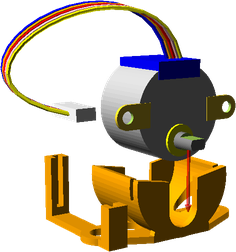
2. Push the pins into the motor clip
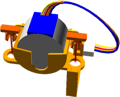
3. Push the wheel onto the motor shaft, then add a rubber band or o-ring to the wheel for extra grip.  You can also add a retaining grub screw if necessary.
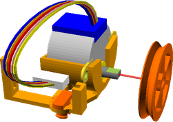
4. Slide the stepper driver into place and plug in the cable for the motor
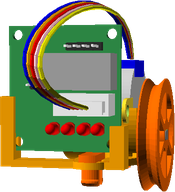

## Right Capstan

### Vitamins

Qty | Vitamin | Image
--- | --- | ---
1 | [28YBJ48 Stepper Motor]() |  | 
1 | [ULN2003 Driver Board]() |  | 

### Printed Parts

Qty | Part Name | Image
--- | --- | ---
1 | [Capstan](../printedparts/stl/Capstan.stl) |  | 
2 | [Pin Tack H7](../printedparts/stl/PinTackH7.stl) |  | 
1 | [Right Motor Clip](../printedparts/stl/RightMotorClip.stl) |  | 

### Assembly Steps

1. Clip the motor into place
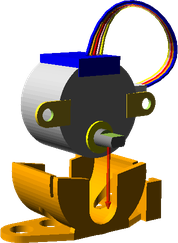
2. Push the pins into the motor clip
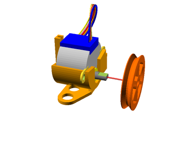
3. Push the wheel onto the motor shaft, then add a rubber band or o-ring to the wheel for extra grip.  You can also add a retaining grub screw if necessary.
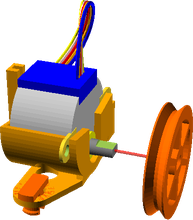
4. Slide the stepper driver into place and plug in the cable for the motor
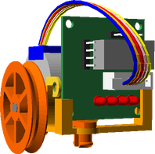

## PenLift

### Vitamins

Qty | Vitamin | Image
--- | --- | ---
1 | [Fine Line Pen]() |  | 

### Printed Parts

Qty | Part Name | Image
--- | --- | ---
1 | [Pen Lift Holder](../printedparts/stl/PenLiftHolder.stl) |  | 
1 | [Pen Lift Slider](../printedparts/stl/PenLiftSlider.stl) |  | 

### Assembly Steps

1. Place the pen holder into the pen slider plate.  Ensure they move freely, the two parts should fall apart easily.  Lightly file or sand the pen holder part if they dont.  Fit an elastic band in the lower grooves and over the top of the mechanism so that it pulls the pen holder down in the slider mechanism.
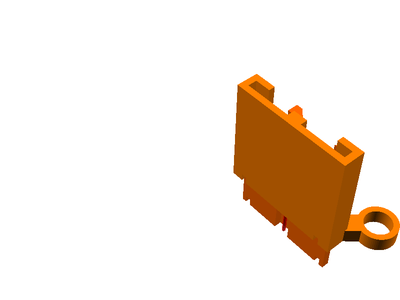
2. Use a small elastic band to securely fasten the pen to the holder.  Make sure that the pen is held vertically and that the nib of the pen will be touching the ground when the slider is almost, but not quite, fully down.
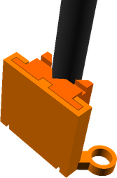

## Rear Caster (x3)

### Vitamins

Qty | Vitamin | Image
--- | --- | ---
3 | [16mm Marble]() |  | 

### Printed Parts

Qty | Part Name | Image
--- | --- | ---
3 | [Caster Housing](../printedparts/stl/CasterHousing.stl) |  | 

### Assembly Steps

1. Insert the marble into the printed housing

## LogoBot Polar Graph

### Vitamins

Qty | Vitamin | Image
--- | --- | ---
1 | [Arduino Pro Mini Pins on top, inc serial pins]() |  | 
1 | [9g Micro Servo]() |  | 
1 | [Servo Horn]() |  | 

### Printed Parts

Qty | Part Name | Image
--- | --- | ---
1 | [Base](../printedparts/stl/Base.stl) |  | 
2 | [Pin Tack H9](../printedparts/stl/PinTackH9.stl) |  | 

### Sub-Assemblies

Qty | Name 
--- | --- 
1 | Left Capstan
1 | Right Capstan
1 | PenLift
3 | Rear Caster

### Assembly Steps

1. Do something
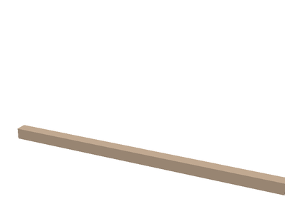

