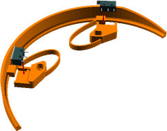
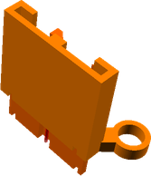
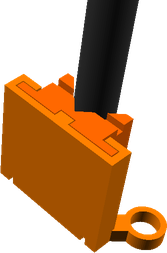
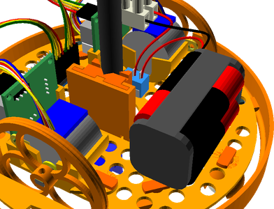
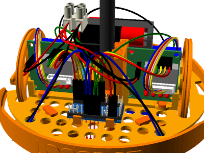

# LogoBot Scribbler
# Assembly Guide

## Bill of Materials

Make sure you have all of the following parts before you begin.

### Vitamins

Qty | Vitamin | Image
--- | --- | ---
1 | [Breadboard 170]() |  | 
2 | [JumperWire Female to Male 4pin 100mm]() |  | 
1 | [16mm Marble]() |  | 
1 | [9g Micro Servo]() |  | 
1 | [Fine Line Pen]() |  | 
1 | [Servo Horn]() |  | 

### Printed Parts

Qty | Part Name | Image
--- | --- | ---
1 | [Basic Shell](../printedparts/stl/BasicShell.stl) |  | 
2 | [BumperStabiliser](../printedparts/stl/BumperStabiliser.stl) |  | 
2 | [Bumper](../printedparts/stl/Bumper.stl) |  | 
1 | [Base](../printedparts/stl/Base.stl) |  | 
1 | [Caster Housing](../printedparts/stl/CasterHousing.stl) |  | 
1 | [Pen Lift Holder](../printedparts/stl/PenLiftHolder.stl) |  | 
1 | [Pen Lift Slider](../printedparts/stl/PenLiftSlider.stl) |  | 
2 | [Wheel](../printedparts/stl/Wheel.stl) |  | 
4 | [Pintack H14.1 BH2](../printedparts/stl/PintackH141BH2.stl) |  | 
1 | [Pintack H6.1 BH2](../printedparts/stl/PintackH61BH2.stl) |  | 
2 | [Pintack H9 BH2](../printedparts/stl/PintackH9BH2.stl) |  | 

## Brain

### Vitamins

Qty | Vitamin | Image
--- | --- | ---
1 | [Breadboard 170]() |  | 

### Assembly Steps

1. Push the Arduino onto the breadboard - make sure you position it correctly,                  as it's a tight fit with the Robot base!

## Bumpers (x2)

### Printed Parts

Qty | Part Name | Image
--- | --- | ---
2 | [Bumper](../printedparts/stl/Bumper.stl) |  | 

### Assembly Steps

1. Place the Microswitches into the holders.  Make sure to get them the right way round so the bumper hits the metal lever.  Repeat for the second bumper.

## Drive Wheel (x2)

### Printed Parts

Qty | Part Name | Image
--- | --- | ---
2 | [Wheel](../printedparts/stl/Wheel.stl) |  | 

### Assembly Steps

1. Push the wheel onto the motor shaft **Optional:** add a rubber band to the wheel for extra grip.

## Rear Caster

### Vitamins

Qty | Vitamin | Image
--- | --- | ---
1 | [16mm Marble]() |  | 

### Printed Parts

Qty | Part Name | Image
--- | --- | ---
1 | [Caster Housing](../printedparts/stl/CasterHousing.stl) |  | 

### Assembly Steps

1. Insert the marble into the printed housing

## PenLift

### Vitamins

Qty | Vitamin | Image
--- | --- | ---
1 | [Fine Line Pen]() |  | 

### Printed Parts

Qty | Part Name | Image
--- | --- | ---
1 | [Pen Lift Holder](../printedparts/stl/PenLiftHolder.stl) |  | 
1 | [Pen Lift Slider](../printedparts/stl/PenLiftSlider.stl) |  | 

### Assembly Steps

1. Place the pen holder into the pen slider plate.  Ensure they move freely, the two parts should fall apart easily.  Lightly file or sand the pen holder part if they dont.  Fit an elastic band in the lower grooves and over the top of the mechanism so that it pulls the pen holder down in the slider mechanism.

2. Use a small elastic band to securely fasten the pen to the holder.  Make sure that the pen is held vertically and that the nib of the pen will be touching the ground when the slider is almost, but not quite, fully down.

## Shell

### Printed Parts

Qty | Part Name | Image
--- | --- | ---
1 | [Basic Shell](../printedparts/stl/BasicShell.stl) |  | 

## Final Assembly

### Vitamins

Qty | Vitamin | Image
--- | --- | ---
2 | [JumperWire Female to Male 4pin 100mm]() |  | 
1 | [9g Micro Servo]() |  | 
1 | [Servo Horn]() |  | 

### Printed Parts

Qty | Part Name | Image
--- | --- | ---
2 | [BumperStabiliser](../printedparts/stl/BumperStabiliser.stl) |  | 
1 | [Base](../printedparts/stl/Base.stl) |  | 
4 | [Pintack H14.1 BH2](../printedparts/stl/PintackH141BH2.stl) |  | 
1 | [Pintack H6.1 BH2](../printedparts/stl/PintackH61BH2.stl) |  | 
2 | [Pintack H9 BH2](../printedparts/stl/PintackH9BH2.stl) |  | 

### Sub-Assemblies

Qty | Name 
--- | --- 
1 | Brain
2 | Bumpers
2 | Drive Wheel
1 | Rear Caster
1 | PenLift
1 | Shell

### Assembly Steps

1. Connect the breadboard assembly to the underside of the base

2. Connect the two bumper assemblies using four of the push pins with flat heads

3. Push the two motor drivers onto the mounting posts

4. Clip the two wheels assemblies onto the base and                    connect the motor leads to the the motor drivers

5. Connect the jumper wires between the motor drivers and the Arduino

6. Clip in the battery pack

7. Clip the power switch into place

8. Clip the LED into place

9. Clip the piezo sounder into place

10. Align the caster assembly with the base

11. Insert a short pin to lock the caster assembly to the base

12. Fit the pen lift assembly using two of the pins and zip tie the servo under the base.

13. Push the shell down onto the base and twist to lock into place

