# LogoBot Scribbler
# Assembly Guide

## Introduction

The LogoBot Scribbler build is broken down into sub-assemblies that can be worked on sequentially by one person, or in parallel if there is more than one person building.

You'll also need a laptop with the right software to control the finished robot

### General Build Tips

* X if left/right, Y is forwards/backwards, Z is up.down

### Tools Required

* None so far!

## Bill of Materials

Make sure you have all of the following parts before you begin.

### Vitamins

Qty | Vitamin | Image
--- | --- | ---
1 | [Breadboard 170]() |  | 
2 | [JumperWire Female to Male 4pin 100mm]() |  | 
1 | [16mm Marble]() |  | 
1 | [9g Micro Servo]() |  | 

### Printed Parts

Qty | Part Name | Image
--- | --- | ---
1 | [Base](../printedparts/stl/Base.stl) |  | 
2 | [Wheel](../printedparts/stl/Wheel.stl) |  | 
1 | [Caster Housing](../printedparts/stl/CasterHousing.stl) |  | 
1 | [Basic Shell](../printedparts/stl/BasicShell.stl) |  | 

## Brain

### Vitamins

Qty | Vitamin | Image
--- | --- | ---
1 | [Breadboard 170]() |  | 

### Assembly Steps

1. Push the Arduino onto the breadboard - make sure you position it correctly,                  as it's a tight fit with the Robot base!
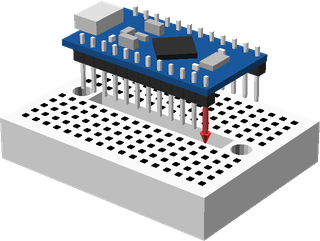

## Drive Wheel (x2)

### Printed Parts

Qty | Part Name | Image
--- | --- | ---
2 | [Wheel](../printedparts/stl/Wheel.stl) |  | 

### Assembly Steps

1. Push the wheel onto the motor shaft 
**Optional:** add a rubber band to wheel for extra grip.
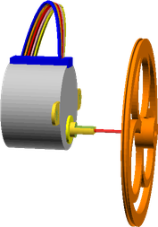

## Rear Caster

### Vitamins

Qty | Vitamin | Image
--- | --- | ---
1 | [16mm Marble]() |  | 

### Printed Parts

Qty | Part Name | Image
--- | --- | ---
1 | [Caster Housing](../printedparts/stl/CasterHousing.stl) |  | 

### Assembly Steps

1. Insert the marble into the printed housing

## Final Assembly

### Vitamins

Qty | Vitamin | Image
--- | --- | ---
2 | [JumperWire Female to Male 4pin 100mm]() |  | 
1 | [9g Micro Servo]() |  | 

### Printed Parts

Qty | Part Name | Image
--- | --- | ---
1 | [Base](../printedparts/stl/Base.stl) |  | 
1 | [Basic Shell](../printedparts/stl/BasicShell.stl) |  | 

### Sub-Assemblies

Qty | Name 
--- | --- 
1 | Brain
2 | Drive Wheel
1 | Rear Caster

### Assembly Steps

1. Connect the breadboard assembly to the underside of the base
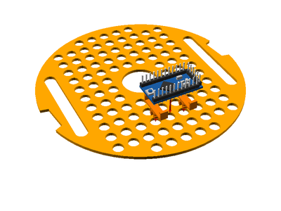
2. Connect the two bumper assemblies
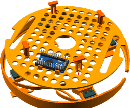
3. Push the two motor drivers onto the mounting posts
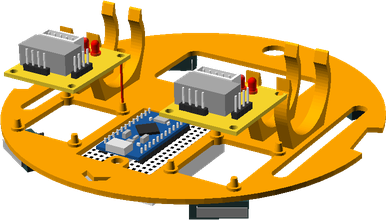
4. Clip the two wheels assemblies onto the base and                     connect the motor leads to the the motor drivers
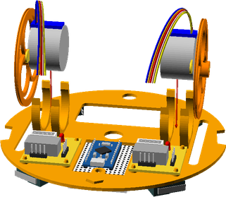
5. Connect the jumper wires between the motor drivers and the Arduino
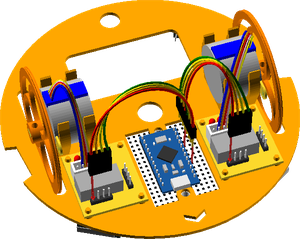
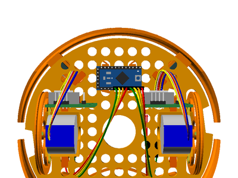
6. Clip in the battery pack
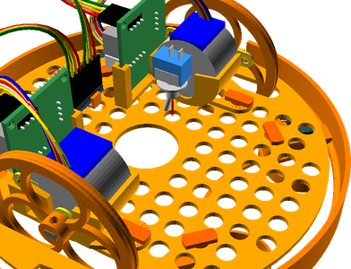
7. Clip the LED into place
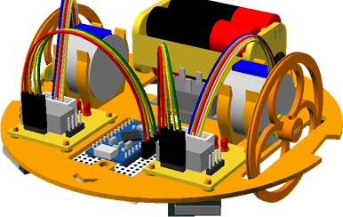
8. Clip the piezo sounder into place
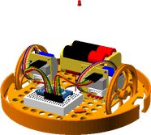
9. Push the caster assembly into the base so that it snaps into place
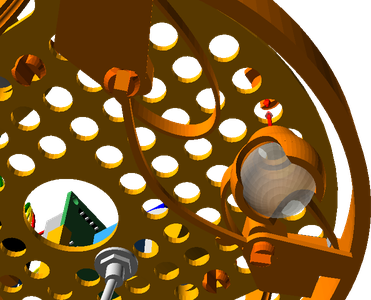
10. Fit the pen lift assembly
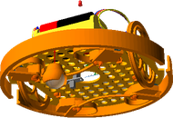
11. Push the shell down onto the base and twist to lock into place
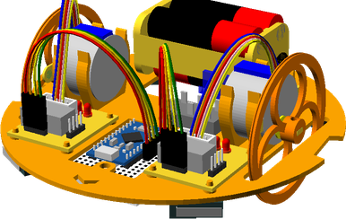

