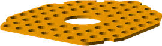
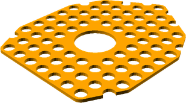

# OptionalExtras
# Assembly Guide

## Bill of Materials

Make sure you have all of the following parts before you begin.

### Printed Parts

Qty | Part Name | Image
--- | --- | ---
1 | [Lego Lid](../printedparts/stl/LegoLid.stl) |  | 
1 | [Simple Base](../printedparts/stl/SimpleBase.stl) |  | 

**Plastic Required**

23.9cm3, 0.03KG,  approx: 0.39 GBP

