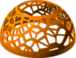

# OptionalExtras
# Printing Guide

### Lego Lid

Metric | Value 
--- | --- 
Quantity | 1
STL | [Lego Lid](../printedparts/stl/LegoLid.stl)
Plastic (Kg) | 0.02
Plastic (cm3) | 13.2
Approx Plastic Cost | 0.25 GBP

### Simple Base

Metric | Value 
--- | --- 
Quantity | 1
STL | [Simple Base](../printedparts/stl/SimpleBase.stl)
Plastic (Kg) | 0.01
Plastic (cm3) | 10.7
Approx Plastic Cost | 0.2 GBP

**Notes**

 * The base requires a well calibrated printer to avoid adhesion issues.  You may also need to ream the holes to 7mm, depending on your print tolerances.

### Voronoi Shell Type1

Metric | Value 
--- | --- 
Quantity | 1
STL | [Voronoi Shell Type1](../printedparts/stl/VoronoiShellType1.stl)
Plastic (Kg) | 0.04
Plastic (cm3) | 29.5
Approx Plastic Cost | 0.55 GBP

### Voronoi Shell Type2

Metric | Value 
--- | --- 
Quantity | 1
STL | [Voronoi Shell Type2](../printedparts/stl/VoronoiShellType2.stl)
Plastic (Kg) | 0.05
Plastic (cm3) | 41.2
Approx Plastic Cost | 0.77 GBP

## Summary

### Statistics

Metric | Value 
--- | --- 
Total Parts | 4
Total Plastic (Kg) | 0.12KG
Total Plastic (cm3) | 94.6cm3
Approx Plastic Cost | 1.77 GBP

