# Vitamin Catalogue

### Contents
 * [ArduinoPro.scad ](#arduinoproscad)
 * [Battery.scad ](#batteryscad)
 * [BatteryPack.scad ](#batterypackscad)
 * [Breadboard.scad ](#breadboardscad)
 * [ESP8266.scad ](#esp8266scad)
 * [FTDIBreakout.scad ](#ftdibreakoutscad)
 * [HCSR04UltrasonicSensor.scad ](#hcsr04ultrasonicsensorscad)
 * [HookAndLoopTape.scad ](#hookandlooptapescad)
 * [JumperWire.scad ](#jumperwirescad)
 * [LED.scad ](#ledscad)
 * [LineSensor.scad ](#linesensorscad)
 * [Marble.scad ](#marblescad)
 * [MicroServo.scad ](#microservoscad)
 * [MicroSwitch.scad ](#microswitchscad)
 * [MiniToggleSwitch.scad ](#minitoggleswitchscad)
 * [Pen.scad ](#penscad)
 * [ServoHorn.scad ](#servohornscad)
 * [TerminalBlock.scad ](#terminalblockscad)
 * [ULN2003DriverBoard.scad ](#uln2003driverboardscad)
 * [screw.scad ](#screwscad)
 * [washer.scad ](#washerscad)

## ArduinoPro.scad

Title | Call | Image
--- | --- | ---
Arduino Pro Mini No Header Pins, no serial pins | `ArduinoPro(type=ArduinoPro_Mini, headerpins=0,serialpins=0)` | 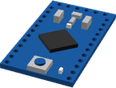

## Battery.scad

Title | Call | Image
--- | --- | ---
AA Battery | `Battery(Battery_AA)` | 

## BatteryPack.scad

Title | Call | Image
--- | --- | ---
Battery Pack | `BatteryPack()` | 

## Breadboard.scad

Title | Call | Image
--- | --- | ---
Breadboard 170 | `Breadboard(Breadboard_170)` | 

## ESP8266.scad

Title | Call | Image
--- | --- | ---
ESP8266 01 | `ESP8266(ESP8266_01)` | 

## FTDIBreakout.scad

Title | Call | Image
--- | --- | ---
FTDI Breakout | `FTDIBreakout()` | 

## HCSR04UltrasonicSensor.scad

Title | Call | Image
--- | --- | ---
HCSR04 Ultrasonic Sensor | `HCSR04UltrasonicSensor()` | 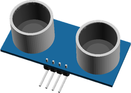

## HookAndLoopTape.scad

Title | Call | Image
--- | --- | ---
Hook and Loop Tape 40x25mm | `HookAndLoopTape(length=40, width=25)` | 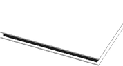

## JumperWire.scad

Title | Call | Image
--- | --- | ---
JumperWire None to None 1pin 100mm | `JumperWire(type=JumperWire_NN1, length=100)` | 
JumperWire Female to None 1pin 100mm | `JumperWire(type=JumperWire_FN1, length=100)` | 
JumperWire Male to Male 2pin 100mm | `JumperWire(type=JumperWire_MM2, length=100)` | 
JumperWire Female to Female 2pin 100mm | `JumperWire(type=JumperWire_FF2, length=100)` | 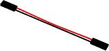
JumperWire Male to Female 2pin 100mm | `JumperWire(type=JumperWire_MF2, length=100)` | 
JumperWire Female to Female 3pin 100mm | `JumperWire(type=JumperWire_FF3, length=100)` | 
JumperWire Female to Female 4pin 100mm | `JumperWire(type=JumperWire_FF4, length=100)` | 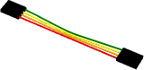
JumperWire Female to Male 4pin 100mm | `JumperWire(type=JumperWire_FM4, length=100)` | 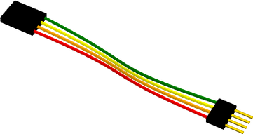

## LED.scad

Title | Call | Image
--- | --- | ---
3mm LED | `LED(LEDType=LED_3mm)` | 
5mm LED | `LED(LEDType=LED_5mm)` | 
RGB_5mm LED | `LED(LEDType=LED_RGB_5mm)` | 

## LineSensor.scad

Title | Call | Image
--- | --- | ---
Line Sensor | `LineSensor()` | 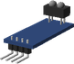

## Marble.scad

Title | Call | Image
--- | --- | ---
16mm Marble | `Marble(Marble_16mm)` | 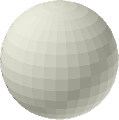

## MicroServo.scad

Title | Call | Image
--- | --- | ---
9g Micro Servo | `MicroServo()` | 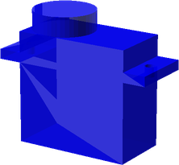

## MicroSwitch.scad

Title | Call | Image
--- | --- | ---
MicroSwitch | `MicroSwitch()` | 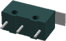

## MiniToggleSwitch.scad

Title | Call | Image
--- | --- | ---
SPST6A Mini Toggle Switch | `MiniToggleSwitch(MiniToggleSwitch_SPST6A)` | 

## Pen.scad

Title | Call | Image
--- | --- | ---
Fine Line Pen | `Pen()` | 

## ServoHorn.scad

Title | Call | Image
--- | --- | ---
Servo Horn | `ServoHorn()` | 

## TerminalBlock.scad

Title | Call | Image
--- | --- | ---
2 Pole 20A Terminal Block | `TerminalBlock(type=TerminalBlock_20A,poles=2)` | 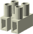

## ULN2003DriverBoard.scad

Title | Call | Image
--- | --- | ---
ULN2003 Driver Board | `ULN2003DriverBoard()` | 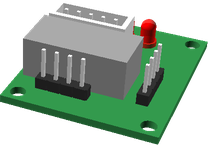

## screw.scad

Title | Call | Image
--- | --- | ---
M2 pan screw x 20mm | `screw(type=M2_pan_screw,length=20, hob_point=0 )` | 
M2.5 pan screw x 20mm | `screw(type=M2p5_pan_screw,length=20, hob_point=0 )` | 
M2.5 cap screw x 20mm | `screw(type=M2p5_cap_screw,length=20, hob_point=0 )` | 
M3 cap screw x 20mm | `screw(type=M3_cap_screw,length=20, hob_point=0 )` | 
M3 pan screw x 20mm | `screw(type=M3_pan_screw,length=20, hob_point=0 )` | 
M3 hex screw x 20mm | `screw(type=M3_hex_screw,length=20, hob_point=0 )` | 
M3 grub screw x 20mm | `screw(type=M3_grub_screw,length=20, hob_point=0 )` | 
M4 cap screw x 20mm | `screw(type=M4_cap_screw,length=20, hob_point=0 )` | 
M4 pan screw x 20mm | `screw(type=M4_pan_screw,length=20, hob_point=0 )` | 
M4 hex screw x 20mm | `screw(type=M4_hex_screw,length=20, hob_point=0 )` | 
M4 grub screw x 20mm | `screw(type=M4_grub_screw,length=20, hob_point=0 )` | 
M5 cap screw x 20mm | `screw(type=M5_cap_screw,length=20, hob_point=0 )` | 
M6 cap screw x 20mm | `screw(type=M6_cap_screw,length=20, hob_point=0 )` | 
M6 selftap screw T25 x 20mm | `screw(type=M6_selftap_screw,length=20, hob_point=0 )` | 
M8 cap screw x 20mm | `screw(type=M8_cap_screw,length=20, hob_point=0 )` | 
M8 hex screw x 20mm | `screw(type=M8_hex_screw,length=20, hob_point=0 )` | 
M10 cap screw x 20mm | `screw(type=M10_cap_screw,length=20, hob_point=0 )` | 
M5 low profile screw x 20mm | `screw(type=M5_lowprofile_screw,length=20, hob_point=0 )` | 
No2 pan wood screw x 20mm | `screw(type=No2_screw,length=20, hob_point=0 )` | 
No4 pan wood screw x 20mm | `screw(type=No4_screw,length=20, hob_point=0 )` | 
No6 pan wood screw x 20mm | `screw(type=No6_screw,length=20, hob_point=0 )` | 
No6 cs  wood screw x 20mm | `screw(type=No6_cs_screw,length=20, hob_point=0 )` | 
6-32 pan screw x 20mm | `screw(type=No632_pan_screw,length=20, hob_point=0 )` | 

## washer.scad

Title | Call | Image
--- | --- | ---
M2 Washer 6x0.5 | `washer(type=M2_washer)` | 
M2.5 Washer 5.9x0.5 | `washer(type=M2p5_washer)` | 
M3 Washer 7x0.5 | `washer(type=M3_washer)` | 
M3.5 Washer 8x0.5 | `washer(type=M3p5_washer)` | 
M4 Washer 9x0.8 | `washer(type=M4_washer)` | 
M5 Washer 10x1 | `washer(type=M5_washer)` | 
M5 Washer 20x1.4 | `washer(type=M5_penny_washer)` | 
M6 Washer 12x1.5 | `washer(type=M6_washer)` | 
M8 Washer 17x1.8 | `washer(type=M8_washer)` | 
M8 Washer 30x1.5 | `washer(type=M8_penny_washer)` | 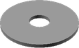
M10 Washer 21x2.2 | `washer(type=M10_washer)` | 
M3 Rubber Washer 10x1.5 | `washer(type=M3_rubber_washer)` | 

